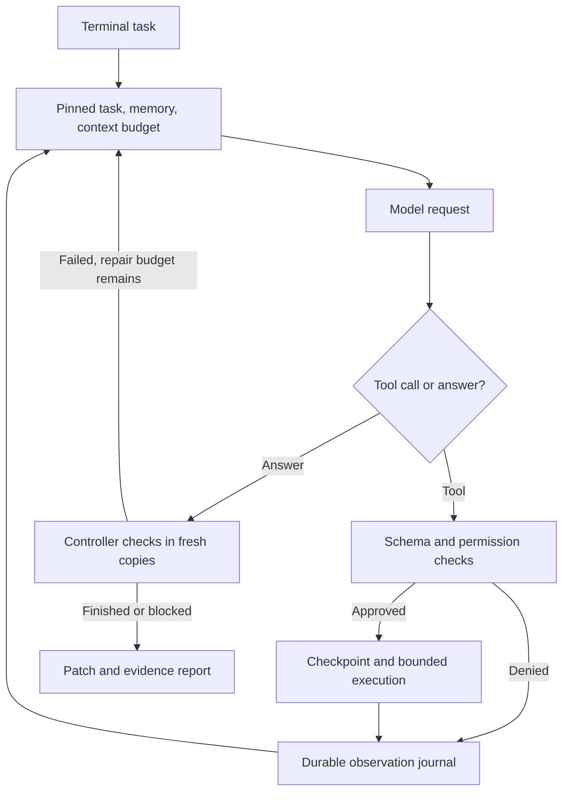

# How Scrappy Forge executes a coding task

The controller is ordinary Python. A model proposes structured tool calls, but the controller owns permissions, execution, persistence, budgets and verification. OpenRouter or a local endpoint supplies model inference; neither replaces the execution engine.

## Source map

| Component | Code | Responsibility |
| --- | --- | --- |
| Terminal | `cli.py` | REPL, approvals, slash commands, one-shot runs, model-upload consent |
| Master loop | `engine.py` | Session lifecycle, model/tool iteration, baseline/final verification, repair bounds, reports |
| Model adapter | `providers.py` | OpenRouter free-only or loopback HTTP, bounded retries, tool-call parsing |
| Context | `context.py` | Estimated token budget, complete tool groups, extractive handoffs, pinned current task |
| Persistence | `store.py` | SQLite sessions, event journal, artifact references and FTS5 memory index |
| Memory | `memory.py` | Project scope, source hashes, stale-note exclusion and provenance |
| Workspace | `workspace.py` | Independent source copies, path constraints, hash-guarded edits, text patch export |
| Policy | `policy.py` | User approvals, plan/read mode, protected paths, explicit allowlists |
| Tool registry | `tools.py` | JSON Schema, lazy discovery, metadata binding and deadlines |
| Execution | `execution.py` | Shell-free argv, output limits, process cleanup, Docker or explicit trusted-local |
| Built-ins | `builtins.py` | File operations, code search, Python symbols, checks, memory and history tools |
| Extensions | `extensions.py` | Versioned command/REST manifests and Markdown skills |
| MCP | `mcp_client.py` | Official SDK, stdio/Streamable HTTP, tools/resources/prompts, transactional connection setup |
| Authentication | `auth.py` | MCP OAuth, bounded loopback callbacks, PKCE/scope checks, encrypted cache and refresh |
| Configuration | `management.py` | User-only registration/import/removal; no package downloads or model access |
| Applying changes | `apply_changes.py` | User-only exact-patch approval, verified hash, drift checks, staged copy, backup and recovery markers |
| Model catalog | `models.py` | Free/tool-capable catalog filtering; no source upload or inference claim |
| Key onboarding | `onboarding.py`, `credentials.py` | Masked entry, fixed key-validation endpoint, opt-in private local records |
| World graph | `world.py` | Scoped collectors, stable entity IDs, bounded queries, freshness and observation deltas |
| Forge account client | `account.py` | User-triggered login/signup/refresh/logout and backend owner commands; origin-bound tokens |
| Public service | `forge_hub/app.py`, `forge_hub/auth.py` | Release wheel/installer, basic login panel, optional identity adapter, owner-only API |

## Local execution versus hosted control plane

The CLI owns model credentials, source copies, context, memory, tools and world
state. It connects directly to OpenRouter/a configured loopback model. Railway
serves the package and optional account API only; it has no agent-loop endpoint.
The account provider owns identities and sessions. Local use does not depend on
an account or give the service access to the machine.

The structured world graph is queried by snapshot ID rather than inferred from
pixels. File/process/socket/window collectors expose source, scope, coverage and
age. Capture is polling, not a consistent transactional OS read. Permissioned
tools are still responsible for re-validating targets before actions. See the
[world-model contract](src/forge_hub/static/world-model.md) for exact schema,
query semantics, privacy, supported adapters and unimplemented platform work.

Owner authorization is deliberately narrow: a verified provider subject must
equal the backend's configured owner UUID. No profile metadata, client role
claim or first-registrant behavior can select the owner. The owner API can list
and suspend/restore hosted accounts, not control local agent sessions.

## State and recovery

Each session has an immutable starting snapshot, an editable workspace copy, up to five local checkpoints, an SQLite event journal and content-addressed tool artifacts. The original project is not edited by the built-in file tools. User-approved `/apply` copies verified changes back with checks and backups; approved host execution and connectors can also have effects outside the workspace. See `SECURITY.md`.

The session state is saved before every model attempt and after each message. A filesystem lock allows one Forge process to own a session at a time. An interrupted tool call gets an uncertain-outcome observation on resume; it is not automatically replayed. Recovery is not exactly-once execution of remote side effects.

Model/tool steps are capped per invocation; HTTP retries, command output and command duration have separate bounds. The user can explicitly resume another bounded invocation. There is no autonomous background scheduler.

## Context and memory are distinct

Context compaction changes the model's active transcript, keeping complete tool-call groups and a bounded extractive handoff. It does not delete archived events. The current task, configured check names and acceptance criteria supplied through the Python API remain pinned. Large observations are retrieved through `artifact_read` or `history_read` when needed.

Project memory holds user or agent-authored notes across sessions. The model cannot silently save a note without the memory tool's permission. Notes linked to a changed source hash are excluded from automatic retrieval. FTS5 is lexical search; neither semantic recall nor a learned memory compressor is implemented.

## Verification semantics

Only checks configured by the user count as acceptance evidence. Baseline checks run against the starting snapshot; final checks run against fresh copies of the current workspace. A passing result must have exit code zero, no timeout, no output overflow and no included-source mutation. Evidence is tied to a tree hash, and stale or failed patch exports cannot retain `review_ready` status.

This resists accidental false-success claims. It cannot prove test completeness, detect every misleading test, or make trusted-local execution safe for an adversarial project. Human review remains necessary.

## Next engineering work

Measure before adding more autonomy. Use representative tasks from your own projects with a fixed model and budget, held-out tests, acceptance criteria and blinded patch review. Compare completion rate, accepted changes per hour, review minutes, regressions, requests/tokens and cost against a strong baseline. Record failures, not just successful demos.

Useful next additions are independent review of the implemented OAuth/apply workflows, repository-aware indexing/LSP adapters, reproducible dependency images, Git worktree/merge workflows, real-model evaluations and measured semantic memory. Multi-agent scheduling should come only after the single-agent loop is reliable and task separation has a demonstrated benefit. None of these future additions is claimed as implemented here.
